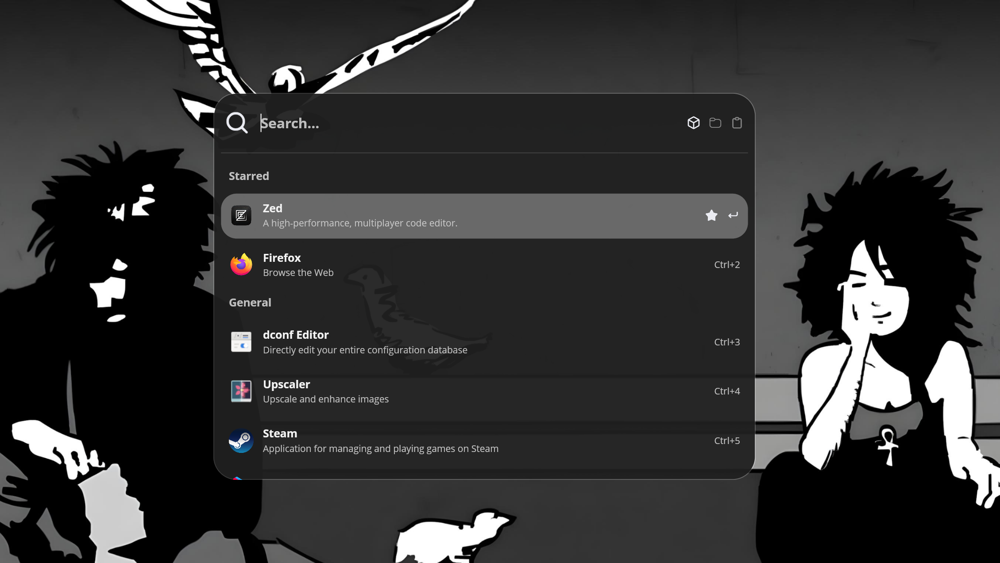

# Lucien

Lucien is a refined, lightweight application launcher built with Rust with Wayland environments in mind. It prioritizes speed, minimal memory overhead, and a clean aesthetic.



## Key Features

- **Fuzzy Search**: Quickly find applications with approximate matching.

- **Favorites**: Mark your most-used apps for instant access.

- **Minimalist Design**: Built with the _Iced GUI_ library for a modern look-and-feel and snappiness.

## System Requirements

To run Lucien, your environment must meet the following criteria:

- **Display Server**: Wayland.

- **Protocol Support**: Your compositor must support the _wlr-layer-shell_ protocol (common in _Sway_, _Hyprland_, _Niri_, etc.).

- **Build Dependencies**: Compiling from source requires the [Rust toolchain](https://rust-lang.org/tools/install/).

## Configuration

For a complete starting point, you can find a reference template in the repository: [assets/preferences.toml](https://github.com/Wachamuli/lucien/blob/main/assets/preferences.toml)

Lucien looks for settings in the following location: `$XDG_CONFIG_HOME/lucien/preferences.toml`

## Keyboard Shortcuts

| Shortcut    | Action                                        |
| ----------- | --------------------------------------------- |
| Enter       | Launch the first entry in the list            |
| Tab         | Select next entry                             |
| Shift + Tab | Select previous entry                         |
| Ctrl + 1-5  | Launch the specific entry (1 through 5)       |
| Ctrl + f    | Toggle favorite status for the selected entry |

You can redefine any of the default keyboard shortcuts within the [keybindings] section of your preferences.toml. For example:

```toml
[keybindings]
control-k = "previous_entry"
control-j = "next_entry"
```

## Installation

1. Clone the repository

```bash
git clone https://github.com/Wachamuli/lucien.git
cd lucien
cargo build --release
```

2. Install to **Path** For easier access, move the binary to your local bin directory:

```bash
cp target/release/lucien ~/.local/bin/
```

## Troubleshooting

If you encounter issues, you can check the logs stored in: `$XDG_CACHE_HOME/.cache/lucien/`.

Alternatively, run Lucien with debug output enabled in your terminal:

```bash
RUST_LOG="lucien=debug" lucien
```
